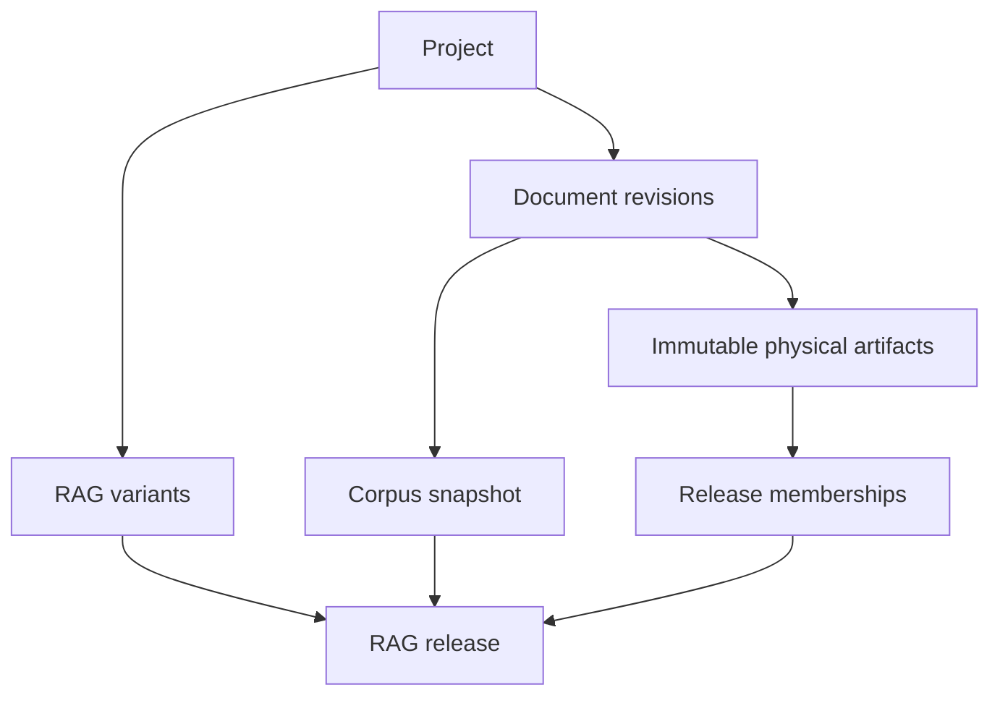

# Plataforma RAG Multi‑Proyecto sobre el estado actual — Plan de implementación

> **For agentic workers:** REQUIRED SUB-SKILL: Use `superpowers:subagent-driven-development` (recommended) or `superpowers:executing-plans` to implement this plan task-by-task. Steps use checkbox (`- [ ]`) syntax for tracking.

**Goal:** Evolucionar `chatbot-sst` desde un corpus SST único hacia una plataforma multi‑proyecto que pueda construir, comparar y conservar releases RAG reproducibles, sin duplicar el pipeline bundle-first ni mezclar proyectos, recetas técnicas, nodos o vectores.

**Architecture:** El diseño separa tres responsabilidades: `project_id` posee documentos y artefactos físicos; `rag_variant_id` identifica una receta semántica inmutable (parseo/normalización, chunking y embedding); `rag_release_id` es un snapshot inmutable de una variante sobre un corpus concreto y una materialización de índice compatible. Las releases referencian artefactos físicos ya sellados mediante membresías; no los duplican ni se convierten en la clave propietaria de los vectores.

**Tech Stack:** Python 3.12, FastAPI, Pydantic, PostgreSQL 18 + pgvector, filesystem versionado, React/TypeScript, Vite, pytest y pruebas frontend existentes.

## Global Constraints

- La base de este plan es `main` en [`3bc9a8a`](https://github.com/jvrincon-syc/chatbot-sst/commit/3bc9a8a6c53cdb429ba100c85fcb6497d06e4e5b), del 10 de agosto de 2026.
- Se conserva un único pipeline de negocio: ingesta → normalización → chunking → embedding → indexing. Una nueva capa de orquestación no puede reimplementar esas etapas.
- Los perfiles de embedding y los `indexing_targets` continúan siendo recursos globales, verificados y resueltos por el servidor. Un `target_binding_key` de proyecto puede elegir una materialización compatible para la release, pero el cliente nunca envía una tabla vectorial ni un `indexing_target_id` directo.
- No se crea una tabla pgvector por proyecto, variante ni release. Se mantienen las tablas por perfil/espacio vectorial establecidas por ADR‑005.
- Los secretos, URLs privadas, payloads de proveedor, texto completo de chunks y vectores no se persisten en preferencias de UI, eventos ni logs.
- El flujo actual de `Activation`/`Retrieval`, `ConsumerScope` y `retrieval_profiles` permanece legacy durante la ejecución de este plan. Publicar una release de plataforma no activa vectores ni cambia consumidores.
- La fase no implementa chat, personalidad/tipos de chatbot, asignación de releases a chatbots, búsqueda de producción, RBAC corporativo ni facturación.
- Este plan es aditivo: no elimina endpoints, tablas, punteros filesystem ni adaptadores legacy. La sustitución de esos componentes queda fuera de alcance y requiere una decisión y un plan posteriores.

---

## Estado legacy que permanece explícitamente en alcance de compatibilidad

El código existente contiene una lane legacy funcional. Se conserva para no interrumpir SST mientras se construye la plataforma, pero no define la identidad de los nuevos proyectos ni de sus releases.

| Componente actual | Restricción observada | Tratamiento en este plan |
| --- | --- | --- |
| `ingestion/paths.py` | `stable_document_id()` depende solo de `source_relpath`. | Se preserva para los flujos legacy; los documentos de plataforma usan identidad `project_id + logical_document_id + revision` y guardan la ruta solo como localizador. |
| `FilesystemChunkBundleRepository.replace()` | Reemplaza archivos asociados a la ruta normalizada actual. | Sigue atendiendo el flujo legacy; la plataforma crea una ruta sellada por `chunk_bundle_id` mediante un adaptador nuevo. |
| `chunk_bundles`, `embedding_bundles`, `indexing_nodes` y `idx_vec_*` | Tienen identidades globales o dependen de `corpus_version`. | Se evolucionan para artefactos nuevos con `project_id` y nodos namespaced; `corpus_version` se conserva únicamente como dato legacy. |
| `ActivateIndexedBundleUseCase` y `retrieval_profiles` | Activan vectores y perfil de retrieval por `corpus_version`. | Se mantienen sin cambio. `PUBLISHED` en plataforma es publicación de catálogo, no activación de retrieval. |
| UI Embedding/Indexing/Activation/Retrieval | Es la interfaz vigente para la lane bundle-first. | Permanece disponible y se etiqueta como **Legacy pipeline**; la UI de plataforma se añade sin modificar sus contratos. |

La consecuencia importante es deliberada: una release de plataforma puede quedar `PUBLISHED`, auditada y con su materialización de índice registrada, pero **todavía no cambia qué release consulta el chatbot existente**. Esa selección de consumidor se decide en una fase posterior, no de forma implícita aquí.

---

## 1. Principios de identidad, propiedad y reutilización

La plataforma necesita reutilizar artefactos físicos exactos sin perder la reproducibilidad de cada RAG. Por tanto, los artefactos pertenecen al proyecto y una release los referencia mediante membresías inmutables:

- Agregar el documento 56 crea `release-002`, pero los 55 documentos sin cambio deben reutilizar sus artefactos físicos.
- Cambiar local → LlamaParse o BGE‑M3 → Voyage crea una variante RAG distinta, sin perder la posibilidad de reutilizar lo que sea compatible aguas arriba.
- Una release publicada debe seguir reconstruible aunque posteriormente aparezca otro documento o se publique otra variante.

La separación queda así:

| Elemento | Propietario / identidad | ¿Puede reutilizarse? | ¿Debe llevar `rag_release_id`? |
| --- | --- | --- | --- |
| Raw source y revisión documental | Proyecto + ruta lógica + hash de revisión | No entre proyectos; sí dentro del proyecto | No |
| Normalizado | Proyecto + revisión documental + fingerprint de procesamiento | Sí, si la receta de procesamiento coincide exactamente | No |
| Chunk bundle | Proyecto + normalizado + fingerprint de chunking | Sí, si el normalizado y perfil coinciden | No |
| Embedding bundle | Proyecto + chunk bundle + perfil/configuración de embedding | Sí, si el espacio vectorial coincide exactamente | No |
| Nodo físico | Proyecto + chunk bundle + `source_chunk_id` | Sí para todas las releases que referencien el bundle | No |
| Vector físico | Proyecto + materialización de embedding + nodo físico + target | Sí para todas las releases compatibles | No |
| Run de build | Intento operacional dentro de una release | Se audita, no se reutiliza como identidad de artefacto | Sí |
| Membresía de release | Release + artefacto sellado | Inmutable después de publicar | Sí |

### Relación objetivo



Una `RAG variant` es un RAG lógico de larga vida. Una `RAG release` es una fotografía auditable de esa variante sobre un corpus. Un nuevo documento altera el `corpus_snapshot_id`, por lo que crea una nueva release, no una nueva variante.

### Capacidad multi-proyecto, multi-motor y multi-release

El modelo admite múltiples proyectos completamente aislados. Cada proyecto puede tener corpus propios, perfiles de procesamiento permitidos y varios modelos de embedding; dentro de un mismo proyecto, el mismo `corpus_snapshot_id` puede alimentar varias variantes RAG.

| Nivel | Qué diferencia | Ejemplo |
| --- | --- | --- |
| `project_id` | Propietario, corpus, configuración y almacenamiento aislados | `sst-general`, `calidad-interna` |
| `corpus_snapshot_id` | Conjunto exacto de revisiones documentales fuente | `sst-corpus-002` con 56 documentos |
| `rag_variant_id` | Receta técnica: parseo/normalización, chunking y embedding | `local-bge-m3`, `llamaparse-voyage-4` |
| `rag_release_id` | Versión inmutable de una variante sobre un snapshot | `sst-local-bge-m3-r002` |

| Proyecto | Corpus snapshot | Variante | Release | Receta fijada |
| --- | --- | --- | --- | --- |
| `sst-general` | `corpus-sst-002` (56 revisiones fuente) | `local-bge-m3` | `r002` | PDF/OCR local + `local-structural-v1` + BGE-M3 |
| `sst-general` | `corpus-sst-002` (las mismas 56 revisiones fuente) | `llamaparse-bge-m3` | `r001` | LlamaParse + `local-structural-v1` + BGE-M3 |
| `sst-general` | `corpus-sst-002` (las mismas 56 revisiones fuente) | `llamaparse-voyage-4` | `r001` | LlamaParse + `local-structural-v1` + Voyage-4 |
| `sst-general` | `corpus-sst-003` (57 revisiones, incluido un documento nuevo) | Cualquier variante construida | Nueva release | La receta de esa variante se mantiene; cambia el corpus congelado |
| `calidad-interna` | `corpus-calidad-001` | `local-bge-m3` | `r001` | Corpus, configuración y artefactos aislados de SST |

Un `corpus_snapshot` congela las revisiones fuente, no obliga a que todas las variantes compartan un normalizado. Por ejemplo, `local` y `llama_cloud` pueden procesar los mismos PDFs fuente con resultados normalizados y bundles distintos; cada variante conserva sus propios artefactos, embeddings y materializaciones compatibles. Un cambio en el corpus crea una release nueva para la variante que se construya, mientras que un cambio de parseo, chunking o modelo de embedding crea otra variante y su propia release.

---

## 2. Modelo de dominio acordado

### 2.1 Project

`project_id` es el límite de propiedad y de almacenamiento. Es un slug técnico único e inmutable después de que el proyecto tenga documentos; `display_name` sí es editable.

Ejemplo: `sst-general`.

El proyecto define:

- catálogo y reglas de tipos documentales;
- políticas permitidas de procesamiento, chunking y embedding;
- configuración editable versionada;
- raíz de almacenamiento aislada;
- documentos fuente y sus revisiones;
- perfiles permitidos de procesamiento local y/o `llama_cloud`, chunking y embedding;
- variantes RAG que puede construir.

### 2.2 Document revision y artefacto normalizado

Un documento lógico se identifica por `project_id + source_relpath`. Cada cambio de bytes crea una `source_document_revision` inmutable. Una misma revisión puede producir varios normalizados si se aplican recetas diferentes.

La identidad de un normalizado nuevo debe incluir, como mínimo:

```text
project_id
+ source_document_revision_id
+ processing_profile_fingerprint
+ schema_version
```

La receta de procesamiento persiste, sin secretos, `parser_provider`, `parser_engine`, revisión observada, configuración sanitizada/fingerprint, normalización, clasificación y origen (`local` o `llama_cloud`). No basta con el `ingestion_origin` actual, porque no registra completamente el motor ni su configuración. es necesario guardar el motor y configuracion 

### 2.3 RAG variant

`rag_variant_id` identifica una receta semántica inmutable dentro de un proyecto. Ejemplos:

```text
sst-local-bge-m3
  processing: local-pdf-ocr-v1
  chunking: local-structural-v1
  embedding: local-bge-m3-v1

sst-llamaparse-voyage-4
  processing: llamaparse-v2026-08-pinned
  chunking: local-structural-v1
  embedding: voyage-4-v1
```

La variante contiene un `semantic_recipe_fingerprint` sobre las referencias y snapshots de configuración. Su receta no se edita: modificar el proveedor/motor/revisión/configuración de parseo, normalización, chunking, embedding o cualquier perfil que cambie la semántica de recuperación crea otro `rag_variant_id`.

El `indexing_target` no forma parte de esa receta si únicamente cambia la lane física de pgvector. Al crear una release, el backend resuelve un `target_binding_key` permitido para el perfil de embedding de la variante y congela el `indexing_target_id` resuelto en el manifiesto. Cambiar a otro target compatible crea una release nueva de la misma variante, con otra materialización; una métrica o configuración que cambie la semántica debe vivir en el perfil y, por tanto, crear variante.

Cambiar solamente concurrencia, batch size o timeout no crea variante ni release si no cambia el artefacto ni el resultado semántico. Se audita como configuración operacional del run.

### 2.4 Corpus snapshot

`corpus_snapshot_id` es una lista ordenada e inmutable de revisiones documentales pertenecientes a un proyecto, con `manifest_hash`/Merkle hash y conteos. Agregar, quitar o reemplazar un documento genera otro snapshot.

### 2.5 RAG release

`rag_release_id` une una variante y un corpus snapshot:

```text
rag_release_id = ragr_...
project_id = sst-general
rag_variant_id = sst-local-bge-m3
corpus_snapshot_id = corpus-sst-002
target_binding_key = local-bge-primary
release_number = 2
```

Estados permitidos:

```text
DRAFT → BUILDING → VALIDATED → PUBLISHED → RETIRED
              ↘ FAILED
```

- `DRAFT`: la selección de corpus y receta está congelada, pero puede reemplazarse explícitamente por una nueva revisión de DRAFT antes de construir.
- `BUILDING`: el orquestador resuelve reuso o ejecuta las etapas faltantes.
- `VALIDATED`: membresía completa, hashes, perfiles, conteos y materializaciones verificadas.
- `PUBLISHED`: snapshot inmutable disponible para asignación manual futura; no activa retrieval.
- `RETIRED`: se conserva para auditoría y rollback de consumidor futuro.
- `FAILED`: conserva evidencia operacional; solo una nueva DRAFT puede reiniciar con cambios materiales.

Una release publicada no se edita. Para incluir un documento nuevo se crea un `corpus_snapshot` nuevo y, para la misma variante, una nueva release. El artefacto de cada documento intacto se referencia desde la nueva membresía sin regenerarse.

---

## 3. Invariantes de seguridad y aislamiento

Esta sección se deriva de código y migraciones revisados en `3bc9a8a`, no de una prueba de penetración. Los puntos observados más relevantes son:

- `FilesystemChunkBundleRepository.replace()` reemplaza el bundle actual por ruta, por lo que hoy no conserva una selección histórica por release.
- `PostgresIndexingNodeWriter.replace_document_nodes()` borra por `document_id` y usa `ON CONFLICT (node_id)`, por lo que dos artefactos con IDs de chunk coincidentes pueden sobrescribirse.
- `PostgresVectorRepository.activate_bundle()` desactiva filas por `embedding_profile_id + indexing_target_id + corpus_version`; esa operación es activación legacy, no publicación neutral.
- El backend ya resuelve profiles/targets en servidor y evita que el navegador escoja la tabla vectorial, un control que se debe conservar.

Los siguientes invariantes son obligatorios para el diseño plataforma:

1. Un comando de build nuevo parte de `rag_release_id`; el servidor deriva de él proyecto, variante, perfil, target y snapshot. Nunca acepta una combinación arbitraria de esos IDs desde el cliente.
2. Toda relación de pertenencia valida el ancestro `release → variant → project` y el propietario del artefacto `artifact.project_id` antes de escribir o leer.
3. Los artefactos sellados son append-only/content-addressed. Ningún endpoint puede sobrescribir archivos referenciados por una release `VALIDATED`, `PUBLISHED` o `RETIRED`.
4. El reuso automático solo ocurre dentro del mismo proyecto y solo por identidad exacta. El reuso entre proyectos queda prohibido por defecto, aunque los bytes sean idénticos.
5. `node_id` pasa a ser una identidad física namespaced; `source_chunk_id` queda separado para evidencia y trazabilidad.
6. Publicar una release no llama `ConsumerScope`, no crea `retrieval_profiles` y no cambia `is_active` en tablas vectoriales.
7. Las rutas de storage se derivan con `ProjectStorageResolver`; los requests no aportan paths absolutos ni relpaths sin validar. La contención de rutas actual se mantiene y se extiende a la raíz del proyecto.
8. El servicio actual no implementa autorización multiusuario. Hasta que exista RBAC, las nuevas rutas deben declararse de operador interno, detrás de feature flag y no exponerse como API pública. Se introduce una interfaz `PlatformAccessPolicy` para no codificar una autorización futura en todos los endpoints.
9. Todo cambio de lifecycle, publicación, retiro, reuso o fallo registra actor de operador, `request_id`, `rag_release_id`, hashes y motivo, sin registrar contenido documental ni secretos.

---

## 4. Estrategia de datos y migración

### 4.1 Qué se mantiene

- `indexing_profiles`, `indexing_targets` y las tablas `idx_vec_*` conservan su papel de perfiles y lanes físicos.
- `chunk_bundles`, `embedding_bundles`, `embedding_runs`, `indexing_runs`, `indexing_nodes` y `readiness_checks` se aprovechan como base, pero cambian sus identidades de plataforma.
- `corpus_version` sigue disponible para legacy/auditoría durante la implementación de plataforma; no es alias de project, variante ni release.
- `ConsumerScope`, `retrieval_profiles`, `Activation` y endpoints `/api/retrieval` se mantienen sin cambiar su semántica. Cualquier reemplazo futuro se decidirá fuera de este documento.

### 4.2 Qué no se debe hacer

- No añadir `rag_release_id` a `chunk_bundles`, `embedding_bundles`, `indexing_nodes` o cada `idx_vec_*` como FK propietaria.
- No sustituir la unicidad física por `project_id + rag_release_id`; impediría reutilizar artefactos sin duplicar datos.
- No seguir usando `node_id == source_chunk_id` para datos nuevos. Ese supuesto es el origen del overwrite entre procesamientos.
- No usar `corpus_version` como identificador de release o filtro de plataforma.
- No hacer una migración destructiva antes de disponer del bootstrap verificable de SST y del adaptador legacy.

### 4.3 Esquema objetivo mínimo

| Grupo | Tablas/proyecciones nuevas o extendidas | Contrato importante |
| --- | --- | --- |
| Proyecto | `rag_projects`, `project_configuration_versions`, `project_document_types`, `project_embedding_profiles`, `project_indexing_target_bindings` | `project_id` único, estable y propietario de artefactos; binding lógico permitido a un target global |
| Procesamiento | `document_processing_profiles`, `chunking_profiles` | configuración sin secretos + fingerprint inmutable |
| Documentos | `project_documents`, `source_document_revisions`, extensión de `indexing_normalized_documents` | un normalizado está ligado a revisión + fingerprint de procesamiento |
| Variante | `rag_variants` | `UNIQUE(project_id, semantic_recipe_fingerprint)` mientras esté activa |
| Corpus | `corpus_snapshots`, `corpus_snapshot_documents` | lista ordenada y hash inmutable |
| Release | `rag_releases`, `rag_release_documents`, `rag_release_chunk_bundles`, `rag_release_embedding_bundles`, `rag_release_index_materializations` | una release referencia artefactos; no los posee y fija el binding/target de su materialización |
| Runs | `rag_build_runs`, `rag_build_steps` y FK contextual en `embedding_runs`/`indexing_runs` | cada intento operacional es release-aware |
| Físico | extensiones de `chunk_bundles`, `embedding_bundles`, `indexing_nodes`, `idx_vec_*` | `project_id` sí; `rag_release_id` no |

Las membresías se separan por tipo para conservar FKs reales. Una tabla polimórfica `artifact_type/artifact_id` reduciría código inicial, pero perdería integridad referencial y complicaría validación.

### 4.4 Identidades y constraints nuevos

| Artefacto | Identidad lógica o constraint propuesta |
| --- | --- |
| Normalizado | `UNIQUE(project_id, source_document_revision_id, processing_profile_fingerprint)` |
| Chunk bundle | `UNIQUE(project_id, normalized_document_id, chunking_profile_fingerprint, bundle_schema_version)` |
| Embedding bundle | `UNIQUE(project_id, source_chunk_bundle_id, embedding_profile_id, configuration_fingerprint, source_content_fingerprint, bundle_schema_version)` |
| Nodo físico | `node_id = sha256(project_id + source_chunk_bundle_id + source_chunk_id)`; almacenar `source_chunk_id` y `source_parent_chunk_id` |
| Vector físico | `UNIQUE(embedding_bundle_id, node_id)` más `project_id`; no depende de release |
| Materialización | `UNIQUE(project_id, embedding_bundle_id, indexing_target_id, storage_schema_version)` |
| Release | `UNIQUE(rag_variant_id, release_number)`, `UNIQUE(project_id, rag_release_id)` para FKs compuestas de seguridad, y snapshot del `target_binding_key`/target resuelto |

---

## 5. Plan de implementación

### Fase 0: ADR, baseline y contrato de identidad

**Files:**

- Create: `docs/adr/ADR-006-rag-platform-project-variant-release.md`
- Create: `docs/rag-platform/identity-and-reuse-contract.md`
- Create: `docs/rag-platform/migration-baseline.md`
- Modify: `docs/adr/README.md`
- Modify: `docs/backend/phase-handoffs.md`
- Test: `app/back/tests/rag_platform/test_identity_contract.py`

**Interfaces produced:**

```python
@dataclass(frozen=True)
class ProjectDocumentContext:
    project_id: str
    source_document_id: str
    source_document_revision_id: str
    processing_profile_id: str

@dataclass(frozen=True)
class RagBuildContext:
    project_id: str
    rag_variant_id: str
    rag_release_id: str
    corpus_snapshot_id: str
    embedding_profile_id: str
    indexing_target_id: str
    semantic_recipe_fingerprint: str
```

- [x] Documentar que los artefactos físicos son propietarios del proyecto y que las releases solo los referencian. — Evidencia: `docs/adr/ADR-006-rag-platform-project-variant-release.md` define la separación proyecto/artefacto/release.
- [x] Registrar la regla de negocio: documento agregado, retirado o reemplazado ⇒ corpus snapshot nuevo ⇒ release nueva. — Evidencia: misma ADR, sección "Decision".
- [x] Registrar la regla de variante: cambio semántico de parseo/normalización/chunking/embedding/perfil de recuperación ⇒ variante nueva y release nueva; cambio de target físicamente compatible ⇒ release nueva, no variante. — Evidencia: `docs/adr/ADR-006-rag-platform-project-variant-release.md` y `rag_platform/domain/identity.py`.
- [x] Separar tres conceptos en el contrato de handoff: `promoted` confirma que la promoción técnica terminó; `release_eligible` confirma que una revisión puede entrar a un snapshot; `PUBLISHED` confirma solo el catálogo de una release. Ninguno es sinónimo de los otros. — Evidencia: `docs/rag-platform/identity-and-reuse-contract.md` y `docs/backend/phase-handoffs.md`.
- [x] Para una revisión con `needs_review`, exigir una decisión de elegibilidad versionada (`approved_after_review`, `operator_waiver` o `blocked`) antes de incluirla en un corpus snapshot. La promoción legacy conserva su comportamiento actual y no se altera. — Evidencia: `app/back/src/rag_platform/application/corpus_snapshot_service.py` y `docs/rag-platform/identity-and-reuse-contract.md`.
- [x] Declarar `corpus_version` como compatibilidad legacy y prohibir su uso como sustituto de `project_id`, `rag_variant_id`, `corpus_snapshot_id` o `rag_release_id` en nuevos contratos. — Evidencia: `docs/adr/ADR-006-rag-platform-project-variant-release.md` y descripción de Fase 0.
- [x] Inventariar, en PostgreSQL real, conteos y hashes de `indexing_normalized_documents`, `chunk_bundles`, `embedding_bundles`, `embedding_runs`, `indexing_runs`, `indexing_nodes`, `idx_vec_*` y `retrieval_profiles` antes de cualquier migración. — Evidencia: `docs/rag-platform/migration-baseline.md` contiene el inventario real y los hashes.
- [x] Verificar los nombres reales de constraints, PKs e índices en la base que se migrará; no asumir que todos los entornos coinciden solo por los archivos SQL. — Evidencia: `docs/rag-platform/migration-baseline.md` lista constraints e índices reales por tabla.
- [x] Crear un manifiesto de baseline con el commit, migraciones aplicadas, rutas de storage y hashes de los contratos. Corregir los READMEs que aún indican `f918b51` para que identifiquen el baseline real `3bc9a8a`, sin usar documentos no versionados como autoridad técnica. — Evidencia: `docs/rag-platform/migration-baseline.md` incluye commit, migraciones aplicadas, rutas de storage y hashes.
- [x] Añadir pruebas de identidad que demuestren que `project_id`, variante, corpus snapshot y release no son intercambiables. — Evidencia: `app/back/tests/rag_platform/test_identity_contract.py`.

**Exit criteria:** ADR aprobado; baseline reproducible archivado; `promoted`, elegibilidad de release, publicación y activación tienen semánticas documentadas distintas; no existe migración irreversible ni cambio de comportamiento.

### Fase 1: Project, configuración y perfiles de receta

**Files:**

- Create: `app/back/src/rag_platform/domain/models.py`
- Create: `app/back/src/rag_platform/domain/errors.py`
- Create: `app/back/src/rag_platform/application/project_service.py`
- Create: `app/back/src/rag_platform/application/recipe_service.py`
- Create: `app/back/src/rag_platform/application/context.py`
- Create: `app/back/src/rag_platform/infrastructure/storage/project_storage.py`
- Create: `app/back/src/rag_platform/infrastructure/postgres/project_repositories.py`
- Create: `migrations/20260810_01_create_rag_platform_catalog.sql`
- Test: `app/back/tests/rag_platform/test_projects.py`  
- Test: `app/back/tests/rag_platform/test_recipe_identity.py`

**Interfaces produced:**

```python
class CreateProjectUseCase:
    def execute(self, request: CreateProjectRequest, *, actor_id: str) -> RagProject: ...

class CreateRagVariantUseCase:
    def execute(self, request: CreateRagVariantRequest, *, actor_id: str) -> RagVariant: ...

class ProjectStorageResolver:
    def roots_for(self, project_id: str) -> ProjectStorageRoots: ...
    def resolve_artifact(self, project_id: str, relative_path: PurePosixPath) -> Path: ...
```

- [x] Crear `rag_projects`, configuración versionada, tipos documentales por proyecto y perfiles de embedding permitidos. — Evidencia: `migrations/20260810_01_create_rag_platform_catalog.sql` define `rag_projects`, `project_configuration_versions`, `project_document_types` y `project_embedding_profiles`.
- [x] Crear `document_processing_profiles` y `chunking_profiles` con proveedor, motor, revisión observada, configuración sanitizada, fingerprint, estado y timestamps. Las credenciales quedan exclusivamente en `secrets.env`/entorno. — Evidencia: `migrations/20260810_01_create_rag_platform_catalog.sql` define `document_processing_profiles` y `chunking_profiles`; `rag_platform/domain/models.py` documenta la sanitización de configuración y fingerprint.
- [x] Crear `rag_variants` con referencia a procesamiento, chunking y embedding, más `semantic_recipe_fingerprint` inmutable; crear `project_indexing_target_bindings` como allowlist backend de claves lógicas hacia targets globales compatibles. — Evidencia: `migrations/20260810_01_create_rag_platform_catalog.sql` define `rag_variants` y `project_indexing_target_bindings`.
- [x] Permitir que cada proyecto habilite de forma independiente perfiles de procesamiento `local` y/o `llama_cloud`, además de uno o más perfiles de embedding compatibles; crear una variante distinta por cada receta semántica seleccionada. — Evidencia: `app/back/src/rag_platform/application/recipe_service.py` valida perfiles por proyecto y crea variantes con `processing_profile_id`, `chunking_profile_id` y `embedding_profile_id`.
- [x] Implementar una plantilla genérica de tipos documentales que conserve las opciones SST como una plantilla seleccionable y añada opciones neutrales. Un proyecto nuevo no preselecciona SST; `sst-general` sí parte de la plantilla SST versionada. — Evidencia: `app/back/src/rag_platform/application/project_service.py` define `_GENERIC_DOCUMENT_TYPES` y `_SST_DOCUMENT_TYPES`; `ProjectDocumentType` usa `DocumentTypeTemplate`.
- [x] Persistir una política de organización de corpus por proyecto, con cuatro opciones iniciales: `sst-legacy-v1`, `source-folders-v1`, `document-types-v1` y `hybrid-v1`. La política define la vista de ingreso/navegación y los relpaths lógicos; nunca define la identidad del documento ni la ubicación canónica de artefactos sellados. — Evidencia: `migrations/20260810_01_create_rag_platform_catalog.sql` declara el enum `corpus_organization_policy` con las cuatro opciones.
- [x] En `document-types-v1`, enrutar inicialmente el archivo a `intake/`; solo después de clasificación o asignación humana se materializa la vista por tipo. No inferir que la ruta de entrada demuestra el tipo documental. — Evidencia: la política de organización de corpus se modela como un contrato separado en `rag_platform/domain/models.py` y la ruta lógica se trata como un localizador, no identidad, en `document_revision_service.py`.
- [x] Implementar `ProjectStorageResolver` con raíces nuevas `data/projects/{project_id}/raw`, `normalized`, `chunks`, `embeddings` y `manifests`. Para `sst-general`, usar un adaptador de lectura de las rutas legacy durante el bootstrap, sin convertir las rutas legacy en la ruta canónica de artefactos nuevos. — Evidencia: `app/back/src/rag_platform/infrastructure/storage/project_storage.py` implementa `roots_for` y `LegacySstReadAdapter`.
- [x] Implementar `PlatformAccessPolicy` como puerto. En esta fase el adaptador puede representar operador interno, pero ningún handler toma `actor_id` de un body o header no autenticado. — Evidencia: `app/back/src/rag_platform/application/context.py` define `PlatformAccessPolicy`; los casos de uso de proyecto y receta lo consumen.
- [x] Bloquear bindings o DRAFTs cuando el target no sea compatible con el perfil de embedding; bloquear variantes cuya receta use una revisión no verificable sin attestation explícita. — Evidencia: `app/back/src/rag_platform/application/recipe_service.py` valida compatibilidad de binding y rechaza revisiones `UNVERIFIABLE` sin `allow_unverifiable_revision`.

**Exit criteria:** dos proyectos pueden existir con taxonomía, configuración y variantes diferentes; sus raíces no se intersectan y no hay credenciales en la base o UI.

### Fase 2: Revisiones documentales, normalizados y corpus snapshots

**Files:**

- Create: `app/back/src/rag_platform/application/document_revision_service.py`
- Create: `app/back/src/rag_platform/application/corpus_snapshot_service.py`
- Create: `app/back/src/rag_platform/infrastructure/postgres/document_repositories.py`
- Create: `migrations/20260810_02_create_project_documents_and_revisions.sql`
- Create: `migrations/20260810_03_create_corpus_snapshots.sql`
- Modify: `app/back/src/ingestion/paths.py`
- Modify: `app/back/src/ingestion/schemas/artifacts.py`
- Modify: `app/back/src/ingestion/schemas/inventory.py`
- Modify: `app/back/src/ingestion/pipeline.py`
- Test: `app/back/tests/rag_platform/test_document_revisions.py`
- Test: `app/back/tests/rag_platform/test_corpus_snapshots.py`
- Test: `app/back/tests/ingestion/test_identity.py`

**Interfaces produced:**

```python
class CreateCorpusSnapshotUseCase:
    def execute(
        self,
        *,
        project_id: str,
        document_revision_ids: Sequence[str],
        actor_id: str,
    ) -> CorpusSnapshot: ...

class ResolveNormalizedArtifactUseCase:
    def resolve_or_build(
        self,
        context: ProjectDocumentContext,
    ) -> NormalizedDocumentArtifact: ...
```

- [x] Crear documento lógico (`project_documents`) y revisión inmutable (`source_document_revisions`) con hash de raw, relpath y trazabilidad de carga. `logical_document_id` se genera al ingreso; `source_relpath` es solo un localizador versionado y puede cambiar sin colisionar entre proyectos. — Evidencia: `migrations/20260810_02_create_project_documents_and_revisions.sql` define `project_documents` y `source_document_revisions` como tablas de plataforma.
- [x] Extender el contrato Schema 2.0 para datos nuevos con `project_id`, `source_document_revision_id`, `normalized_document_id`, `processing_profile_id` y fingerprints; conservar un adaptador explícito Schema 2.0 legacy para SST. — Evidencia: `app/back/src/ingestion/schemas/artifacts.py` define `PlatformDocumentIdentity` opcional y lo incluye en `MetadataArtifact.platform_identity`.
- [x] Reemplazar la identidad nueva basada solo en `source_relpath` por un ID determinista que incluya proyecto, revisión y recipe fingerprint. Los `document_id` legacy no se reescriben durante esta fase. — Evidencia: `app/back/src/rag_platform/application/document_revision_service.py` genera IDs `sdoc_` y `srev_` a partir de proyecto, relpath y hash de raw usando `ingestion.paths.platform_document_id`/`platform_revision_id`.
- [x] Resolver `DocumentType` contra el catálogo y la política versionados del proyecto. El Literal actual solo permanece en el adaptador SST/legacy hasta que la validación de política esté cubierta. — Evidencia: `app/back/src/rag_platform/application/classification_service.py` usa `resolve_document_type` de `rag_platform/domain/classification.py` para validar el tipo contra la configuración del proyecto.
- [x] Extraer reglas SST de `ingestion/classification/rules.py` hacia una política cargada desde el snapshot de configuración; conservar el adaptador que produce exactamente las decisiones SST actuales. — Evidencia: `app/back/src/rag_platform/infrastructure/classification/sst_policy.py` envuelve `ingestion.classification.rules.classify_document` y traduce sus resultados al contrato de plataforma.
- [x] Crear `corpus_snapshots` con orden determinista, hashes de las revisiones seleccionadas, conteo de documentos y `manifest_hash`. — Evidencia: `migrations/20260810_03_create_corpus_snapshots.sql` y `app/back/src/rag_platform/application/corpus_snapshot_service.py` calculan `manifest_hash` de forma determinista.
- [x] Guardar en cada membresía de snapshot la decisión de elegibilidad de su revisión; no permitir que un `needs_review` se haga releaseable solo porque fue promovido técnicamente. — Evidencia: `migrations/20260810_03_create_corpus_snapshots.sql` usa `eligibility_decision` y `app/back/src/rag_platform/application/corpus_snapshot_service.py` valida `needs_review` vs `approved_after_review`/`operator_waiver`.
- [x] Hacer que cualquier cambio material de selección genere un snapshot nuevo, incluso si la ruta lógica es igual. — Evidencia: `create_corpus_snapshot` es idempotente sólo por `manifest_hash`, y un cambio en la selección o en las decisiones de elegibilidad cambia el hash.

**Exit criteria:** un raw modificado no sobreescribe la revisión anterior; dos proyectos pueden tener la misma ruta relativa sin colisión; un corpus snapshot puede reconstruirse solo con sus rows y hashes.

### Fase 3: Artefactos físicos inmutables y ledger de chunking

**Files:**

- Create: `app/back/src/rag_platform/application/artifact_reuse_service.py`
- Create: `app/back/src/rag_platform/infrastructure/postgres/artifact_repositories.py`
- Create: `migrations/20260810_04_extend_project_owned_artifacts.sql`
- Modify: `app/back/src/chunking/application/run_service.py`
- Modify: `app/back/src/chunking/infrastructure/filesystem_chunk_repository.py`
- Modify: `app/back/src/chunking/infrastructure/filesystem_run_repository.py`
- Modify: `app/back/src/embedding/infrastructure/filesystem/chunk_bundle_reader.py`
- Test: `app/back/tests/chunking/integration/test_run_service_persistence.py`
- Test: `app/back/tests/rag_platform/test_artifact_reuse.py`
- Test: `app/back/tests/rag_platform/test_chunk_bundle_immutability.py`

**Interfaces produced:**

```python
class ArtifactReusePolicy:
    def find_reusable_normalized(... ) -> NormalizedDocumentArtifact | None: ...
    def find_reusable_chunk_bundle(... ) -> ChunkBundleRef | None: ...
    def find_reusable_embedding_bundle(... ) -> EmbeddingBundle | None: ...

class RagBuildRunRepository(Protocol):
    def start_step(self, context: RagBuildContext, stage: BuildStage, ...) -> RagBuildStep: ...
    def complete_step(self, step_id: str, outcome: BuildOutcome, ...) -> RagBuildStep: ...
```

- [x] Crear `rag_build_runs` y `rag_build_steps` como ledger durable para todas las etapas y reusos. El run sí apunta a release; el bundle físico no. — **Evidencia:** `migrations/20260810_04_extend_project_owned_artifacts.sql` crea ambas tablas (`rag_build_runs.rag_release_id TEXT NOT NULL` apunta a la release; el bundle físico no lleva `rag_release_id`). Dominio: `domain/models.py::RagBuildStep`, enums `BuildStage`/`BuildOutcome`/`ReuseKind`. Puerto `application/artifact_reuse_service.py::RagBuildRunRepository` (`start_step`/`complete_step`) + fake in-memory. **Aplicado a la BD viva** `chatbot_sst` (tablas presentes y vacías, verificado). Test `tests/rag_platform/test_artifact_reuse.py::test_ledger_registra_pasos_de_build_con_clasificacion_de_reuso`.
- [x] Cambiar el repositorio filesystem para almacenar bundles sellados bajo `data/projects/{project_id}/chunks/{chunk_bundle_id}/`, con manifest, checksums, parents y children. `latest` puede existir como vista de UI por proyecto, pero ninguna release puede depender de él. — **Evidencia:** `infrastructure/storage/sealed_chunk_store.py::SealedChunkStore.stage_and_seal` escribe `manifest.json`, `parent_chunks.jsonl`, `child_chunks.jsonl` y `checksums.json` bajo `chunks/{chunk_bundle_id}/` (content-addressed; sin dependencia de `latest`), con contención de rutas vía `ProjectStorageResolver`. Tests `tests/rag_platform/test_chunk_bundle_immutability.py::test_sella_bundle_content_addressed_cuando_es_nuevo`.
- [x] Mantener `replace()` sin cambios para el flujo legacy y añadir `stage_and_seal()` para la plataforma; el nuevo adaptador no puede llamar a `replace()` sobre una ruta compartida. — **Evidencia:** la lógica de escritura atómica se extrajo a `core/atomic_fs.py` (DRY) y `chunking/infrastructure/filesystem_chunk_repository.py::replace()` delega en ella con comportamiento **byte-idéntico** (prueba de regresión `tests/chunking/integration/test_run_service_persistence.py::test_replace_legacy_serializa_byte_identico_cuando_helpers_extraidos`). `SealedChunkStore` usa `core.atomic_fs` directamente y **nunca** llama a `replace()` ni escribe sobre la ruta legacy.
- [x] Añadir `project_id`, `normalized_document_id`, profile fingerprint y estado de sellado a `chunk_bundles`. Sustituir la unicidad global de `bundle_fingerprint` por la identidad física definida en la sección 4.4. — **Evidencia:** `20260810_04` añade `project_id`, `normalized_document_id`, `chunking_profile_fingerprint`, `bundle_schema_version`, `sealing_status` (todas nullable, verificado en `chatbot_sst`) y crea el índice único **parcial** `uq_chunk_bundles_physical_identity` con la identidad física §4.4 `WHERE project_id IS NOT NULL`. **Desviación explícita (decisión del usuario):** la unicidad global legacy `chunk_bundles_bundle_fingerprint_key` NO se retira en esta fase — se **mantiene** y su retiro se difiere a Fase 4 (ordenamiento de migración segura §4, "no destructivo antes del bootstrap"). Filas legacy verificadas intactas (56 filas, todas con `project_id` NULL).
- [x] Mantener `corpus_version` como columna legacy; no incluirlo en la identidad de bundles nuevos. — **Evidencia:** `20260810_04` conserva `corpus_version` sin tocarla y el índice de identidad física `uq_chunk_bundles_physical_identity` **no la incluye** (solo `project_id + normalized_document_id + chunking_profile_fingerprint + bundle_schema_version`). Comentario explícito en la migración (§4.3/§4.4).
- [x] Hacer que la entrada de build de plataforma reciba solo `rag_release_id`; el backend resuelve snapshot y perfil de chunking. `ChunkingRunRequest` y la API legacy conservan su payload actual. — **Evidencia:** el contrato de build de plataforma se ancla en `RagBuildContext` (`domain/identity.py`), cuya identidad primaria es `rag_release_id`; el ledger `RagBuildRunRepository.start_step(context, stage)` lo consume. `ChunkingRunRequest` y `/api/chunking` **no se modificaron** (verificado). **Alcance Fase 3:** se fija la forma del contrato; el endpoint/orquestador que deriva snapshot+perfil desde `rag_release_id` es Fase 5/7 (declarado como deuda).
- [x] Registrar por cada reuso `exact_identity`, `revalidated_compatibility` o `operator_approved`, junto con el artefacto origen. `operator_approved` no puede salvar incompatibilidad de dimensión, métrica o proyecto. — **Evidencia:** enum `domain/models.py::ReuseKind` (`EXACT_IDENTITY`/`REVALIDATED_COMPATIBILITY`/`OPERATOR_APPROVED`); `rag_build_steps.reuse_kind` (CHECK) + `source_artifact_id` registran clasificación y artefacto origen. Guarda de dominio `ensure_reuse_within_project` + error `CrossProjectReuseForbidden`: ni `operator_approved` cruza proyectos. Test `tests/rag_platform/test_artifact_reuse.py::test_operator_approved_no_puede_reutilizar_entre_proyectos`. (Validación de dimensión/métrica de embedding → Fase 4, declarada.)

**Exit criteria:** crear `release-002` con un documento adicional reutiliza los 55 bundles intactos; un bundle referenciado por `release-001` no cambia de ruta, hash ni contenido.

### Fase 4: Embedding, nodos y vectores físicos sin colisiones

**Files:**

- Create: `migrations/20260810_05_release_aware_runs_and_namespaced_nodes.sql`
- Create: `migrations/20260810_06_extend_idx_vec_project_ownership.sql`
- Modify: `app/back/src/embedding/domain/models.py`
- Modify: `app/back/src/embedding/application/run_service.py`
- Modify: `app/back/src/embedding/application/bundle_builder.py`
- Modify: `app/back/src/embedding/infrastructure/postgres/repositories.py`
- Modify: `app/back/src/indexing/domain/bundle_first.py`
- Modify: `app/back/src/indexing/application/bundle_first/index_bundle.py`
- Modify: `app/back/src/indexing/infrastructure/postgres/bundle_first.py`
- Modify: `app/back/src/indexing/infrastructure/postgres/vector_repository.py`
- Test: `app/back/tests/embedding/test_embedding_run_flow.py`
- Test: `app/back/tests/indexing/test_durable_profile_alignment.py`
- Test: `app/back/tests/rag_platform/test_node_identity_isolation.py`
- Test: `app/back/tests/rag_platform/test_vector_lane_isolation.py`

**Interfaces produced:**

```python
def physical_node_id(
    *, project_id: str, source_chunk_bundle_id: str, source_chunk_id: str
) -> str: ...

class IndexingMaterializationRepository(Protocol):
    def find_ready(
        self, *, project_id: str, embedding_bundle_id: str, indexing_target_id: str
    ) -> IndexingMaterialization | None: ...
```

- [ ] Hacer que `EmbeddingRun` e `IndexingRun` registren `project_id`, `rag_variant_id` y `rag_release_id` como contexto operacional. Esto no cambia la identidad de `EmbeddingBundle`.
- [ ] Cambiar la identidad de `EmbeddingBundle` para que se base en proyecto, chunk bundle, profile/configuration fingerprint y contenido fuente; eliminar `corpus_version` de la unicidad de datos nuevos.
- [ ] Migrar constraints en orden seguro: añadir columnas nullable y proyecciones de plataforma; verificar y backfillear los rows que tengan evidencia; crear índices parciales para datos con `project_id`; mover los writers; y solo entonces retirar la unicidad global que impediría que dos proyectos con bytes iguales tengan bundles propios. Los rows sin evidencia permanecen `legacy_unverified`.
- [ ] Cambiar `IndexingNodeRecord` para separar `node_id` físico de `source_chunk_id` y `source_parent_chunk_id` de evidencia.
- [ ] Reemplazar `replace_document_nodes(document_id=...)` por una operación scoped por `project_id + source_chunk_bundle_id`. No borrar ni actualizar nodos de otra materialización al indexar una variante o release posterior.
- [ ] Generar `node_id` físico namespaced con un hash de una representación canónica etiquetada de `project_id`, `source_chunk_bundle_id` y `source_chunk_id`; conservar los IDs de chunks fuente en metadata y columnas explícitas. No concatenar valores sin separadores ni conservar `node_id == source_chunk_id` para filas de plataforma.
- [ ] Añadir `project_id` a las tablas `idx_vec_*`; mantener la unicidad `(embedding_bundle_id, node_id)` y dejar `rag_release_id` fuera de las filas vectoriales.
- [ ] Crear `indexing_materializations`/proyección equivalente que represente la escritura de un embedding bundle en un target. Una release referencia esta materialización, no un estado activo global.
- [ ] Validar transaccionalmente: owner de proyecto, pertenencia de profile/target, dimensión, métrica, checksum, conteos de chunks/nodos/vectores y estado sellado.

**Exit criteria:** local/BGE y local/Voyage pueden compartir normalizado/chunks cuando corresponde; nunca comparten embedding/vector. LlamaParse y local generan artefactos distintos salvo una equivalencia explícitamente comprobada. Dos proyectos no pueden sobrescribir nodos o vectores entre sí.

### Fase 5: Variantes, DRAFT, membresías y orquestador de release

**Files:**

- Create: `app/back/src/rag_platform/application/release_service.py`
- Create: `app/back/src/rag_platform/application/release_build_service.py`
- Create: `app/back/src/rag_platform/application/release_validator.py`
- Create: `app/back/src/rag_platform/domain/lifecycle.py`
- Create: `app/back/src/rag_platform/infrastructure/postgres/release_repositories.py`
- Create: `migrations/20260810_07_create_rag_variants_releases_and_memberships.sql`
- Test: `app/back/tests/rag_platform/test_release_lifecycle.py`
- Test: `app/back/tests/rag_platform/test_release_incremental_build.py`
- Test: `app/back/tests/rag_platform/test_release_membership_integrity.py`

**Interfaces produced:**

```python
class CreateRagReleaseDraftUseCase:
    def execute(
        self,
        *,
        rag_variant_id: str,
        corpus_snapshot_id: str,
        target_binding_key: str | None,
        actor_id: str,
    ) -> RagRelease: ...

class BuildRagReleaseUseCase:
    def execute(self, *, rag_release_id: str, actor_id: str) -> RagReleaseBuildReport: ...

class ValidateRagReleaseUseCase:
    def execute(self, *, rag_release_id: str, actor_id: str) -> ReleaseValidationReport: ...
```

- [ ] Implementar `CreateRagReleaseDraft` que compruebe que snapshot y variante pertenecen al mismo proyecto, resuelva solo un `target_binding_key` permitido para el perfil de embedding, pinne recipe/configuration/target snapshots y cree la release en `DRAFT`.
- [ ] Permitir que un mismo `corpus_snapshot_id` tenga DRAFTs y releases en varias variantes del mismo proyecto; mantener `release_number` único dentro de cada `rag_variant_id`, nunca global para el proyecto.
- [ ] Bloquear la creación y validación de una release cuando alguna revisión tenga elegibilidad `blocked`; requerir que una excepción `operator_waiver` incluya actor, motivo, fecha y el snapshot de política que autorizó la excepción.
- [ ] Implementar un planner que recorra cada revisión del corpus snapshot y aplique `ArtifactReusePolicy` en orden: normalizado → chunk → embedding → materialización de índice.
- [ ] Cuando no haya reuso exacto, invocar los servicios existentes de ingesta/chunking/embedding/indexing mediante puertos/adaptadores; no copiar sus algoritmos al módulo plataforma.
- [ ] Crear membresías concretas en el mismo commit lógico que registra el resultado del paso. La release nunca se considera completa si falta una revisión o si un artefacto pertenece a otro proyecto.
- [ ] Requerir que el manifiesto de release contenga hashes de corpus snapshot, recipe, configuración de proyecto, artefactos y conteos; su `release_manifest_hash` se congela al validar.
- [ ] Implementar lifecycle estricto y actor/motivo/auditoría para `VALIDATED`, `PUBLISHED`, `RETIRED` y `FAILED`. `PUBLISHED` significa que el catálogo de plataforma acepta la release; no significa que una lane legacy esté activa.
- [ ] No modificar una `DRAFT` validada en sitio: un cambio de corpus o recipe vuelve a crear el snapshot/membresía antes de una nueva validación.

**Exit criteria:** `sst-local-bge-m3/r002` contiene los 56 documentos exactos y puede reconstruirse; `r001` conserva sus 55 documentos y no ve el documento 56.

### Fase 6: Publicación de catálogo y coexistencia legacy

**Files:**

- Create: `app/back/src/rag_platform/application/publication_service.py`
- Create: `app/back/src/rag_platform/application/platform_access.py`
- Modify: `app/back/src/core/feature_flags.py`
- Modify: `app/back/src/api/dependencies.py`
- Modify: `app/back/src/api/app.py`
- Modify: `docs/backend/phase-handoffs.md`
- Test: `app/back/tests/rag_platform/test_publication_neutrality.py`
- Test: `app/back/tests/core/test_pipeline_composition.py`
- Test: `app/back/tests/retrieval/test_pipeline_api.py`

**Interfaces produced:**

```python
class PublishRagReleaseUseCase:
    def execute(self, *, rag_release_id: str, actor_id: str) -> RagRelease: ...

class PlatformAccessPolicy(Protocol):
    def require_project_operator(self, *, actor: PlatformActor, project_id: str) -> None: ...
```

- [ ] Añadir `SST_FEATURE_RAG_PLATFORM_V1`, deshabilitado por defecto y separado de los feature flags bundle-first existentes. Habilitarlo expone la plataforma administrativa; no cambia la lane utilizada por retrieval.
- [ ] Registrar servicios plataforma en el composition root sin modificar los servicios legacy de retrieval.
- [ ] Implementar publicación como una transición de estado que verifica el manifiesto y marca `PUBLISHED` de forma transaccional.
- [ ] Probar de forma negativa que el módulo de publicación no importa `ConsumerScope`, `RetrievalProfile`, `ActivateIndexedBundleUseCase` ni escribe `is_active`.
- [ ] Mantener `ActivateIndexedBundleUseCase`, `RollbackIndexedBundleUseCase` y `/api/retrieval` como legacy; documentar que una futura selección de otra release publicada no es rollback de vector rows y no forma parte de este plan.
- [ ] Añadir eventos `rag_release_created`, `rag_release_build_step_completed`, `rag_release_validated`, `rag_release_published` y `rag_release_retired`, con correlación y redacción compatibles con `core.logging.observability`.

**Exit criteria:** publicar una release no crea ni actualiza `retrieval_profiles`, no usa el scope `chatbot/sst-default`, no altera filas activas existentes y deja el estado legacy intacto.

### Fase 7: API de plataforma y contratos OpenAPI

**Files:**

- Create: `app/back/src/rag_platform/api/router.py`
- Create: `app/back/src/rag_platform/api/schemas.py`
- Create: `app/back/src/rag_platform/api/dependencies.py`
- Modify: `app/back/src/api/app.py`
- Modify: `app/back/src/api/dependencies.py`
- Modify: `scripts/api/export_pipeline_openapi.py`
- Modify: `docs/api/BUNDLE_FIRST_FRONTEND_HANDOFF.md`
- Modify: `docs/api/pipeline-openapi.json`
- Test: `app/back/tests/rag_platform/test_platform_api.py`

**API contract:**

```text
GET    /api/platform/projects
POST   /api/platform/projects
GET    /api/platform/projects/{project_id}
PATCH  /api/platform/projects/{project_id}
GET    /api/platform/projects/{project_id}/configuration
PATCH  /api/platform/projects/{project_id}/configuration
GET    /api/platform/projects/{project_id}/variants
POST   /api/platform/projects/{project_id}/variants
POST   /api/platform/corpus-snapshots
POST   /api/platform/releases
GET    /api/platform/releases/{rag_release_id}
POST   /api/platform/releases/{rag_release_id}/build
POST   /api/platform/releases/{rag_release_id}/validate
POST   /api/platform/releases/{rag_release_id}/publish
POST   /api/platform/releases/{rag_release_id}/retire
```

- [ ] Cada comando de build/lifecycle recibe `rag_release_id` como identidad primaria; el servidor deriva `project_id`, variante, perfil y target ya congelado. La creación de DRAFT acepta como máximo un `target_binding_key` validado, nunca un `indexing_target_id` o nombre de tabla.
- [ ] Las rutas de creación de snapshot/variant validan cada FK y rechazo de combinación cruzada antes de iniciar workers.
- [ ] Aceptar la elección de layout solo mediante valores de plantilla permitidos y validar que los relpaths de ingreso permanezcan dentro de la raíz del proyecto. Ningún endpoint recibe una ruta absoluta, nombre de tabla o secreto.
- [ ] Requerir `Idempotency-Key` para mutaciones de build y lifecycle, con fingerprint que incluya la acción y el release, no contenido sensible.
- [ ] Mantener `/api/chunking`, `/api/embedding`, `/api/indexing` y `/api/retrieval` como contratos legacy; marcar claramente el modo en la documentación y UI sin romper responses existentes.
- [ ] Implementar límites de tamaño/paginación y un máximo de documentos por build request; el servidor reacciona con error controlado antes de programar trabajo ilimitado.

**Exit criteria:** el frontend puede construir una release sin conocer paths, tablas vectoriales ni una terna manual de IDs; los requests cruzados devuelven un error de dominio, no un resultado parcial.

### Fase 8: GUI de plataforma integrada con la UI actual

**Files:**

- Create: `app/front/src/features/platform/platformApi.ts`
- Create: `app/front/src/features/platform/platformTypes.ts`
- Create: `app/front/src/features/platform/platformState.ts`
- Create: `app/front/src/features/platform/ProjectConfigurationWorkspace.tsx`
- Create: `app/front/src/features/platform/RagReleaseWorkspace.tsx`
- Modify: `app/front/src/features/dashboard/dashboardTypes.ts`
- Modify: `app/front/src/features/dashboard/dashboardPersistence.ts`
- Modify: `app/front/src/features/dashboard/DashboardApp.tsx`
- Modify: `app/front/src/features/dashboard/dashboardNavigation.ts`
- Modify: `app/front/src/features/embeddingIndexing/EmbeddingIndexingWorkspace.tsx`
- Modify: `app/front/src/features/embeddingIndexing/useEmbeddingIndexingPipeline.ts`
- Test: `app/front/src/features/platform/platformState.test.mjs`
- Test: `app/front/src/features/platform/ProjectConfigurationWorkspace.test.tsx`
- Test: `app/front/src/features/platform/RagReleaseWorkspace.test.tsx`

- [ ] Añadir una vista de configuración de proyecto con secciones: general, tipos documentales, perfiles permitidos, processing profiles y variantes RAG.
- [ ] En la vista de configuración permitir elegir y versionar el layout `source-folders`, `document-types`, `hybrid` o la plantilla SST. Explicar que afecta organización y navegación del corpus, no la identidad ni el hash de artefactos.
- [ ] Persistir en `DashboardPreferences` solo `selectedProjectId`, `selectedRagVariantId` y `selectedRagReleaseId`; validar que su relación siga existiendo y nunca persistir secrets, paths absolutos, contenido, checksums completos o vectores.
- [ ] Crear una experiencia de release con pasos: seleccionar variante y corpus snapshot → crear DRAFT → build/reuso → validar → publicar. No mostrar Activation/Retrieval como parte de la salida plataforma.
- [ ] Reutilizar componentes visuales de `features/chunking`, `features/embedding`, `features/indexing` y `features/embeddingIndexing`; crear adaptadores de API en vez de acoplar la UI a respuestas legacy.
- [ ] Conservar el workspace legacy con su stepper Embedding → Indexing → Activation → Retrieval y etiquetarlo como **Legacy pipeline**. La nueva pantalla no lo reemplaza ni cambia su navegación durante este plan.
- [ ] Deshabilitar botones y mostrar causas de bloqueo cuando una DRAFT no esté lista, una variante no pertenezca al proyecto o el build esté corriendo.

**Exit criteria:** un operador puede crear dos proyectos, dos variantes y releases independientes sin perder las pantallas ni los contratos actuales.

### Fase 9: Bootstrap SST y verificación de paridad, sin activar consumidores

**Files:**

- Create: `scripts/rag_platform/bootstrap_sst_general.py`
- Create: `scripts/rag_platform/verify_release_manifest.py`
- Create: `docs/runbooks/bootstrap-sst-general.md`
- Create: `docs/runbooks/rebuild-rag-release.md`
- Create: `migrations/20260810_08_backfill_sst_general.sql`
- Modify: `scripts/indexing/prepare_postgres_indexing.py`
- Test: `app/back/tests/rag_platform/test_sst_bootstrap.py`
- Test: `app/back/tests/indexing/test_embedding_persistence_backfill.py`

- [ ] Crear `sst-general` con configuración y taxonomía que reproduzca la conducta SST actual mediante adaptadores explícitos y la plantilla `sst-legacy-v1`.
- [ ] Ejecutar bootstrap primero en `--dry-run`: correlacionar cada artefacto legacy con proyecto, documento lógico, revisión, normalizado, bundle, embedding y materialización cuando exista evidencia suficiente.
- [ ] Marcar registros sin prueba como `legacy_unverified`; no inventar una release validada a partir de ellos.
- [ ] Crear el primer corpus snapshot SST con los documentos respaldados por el baseline y construir `sst-local-bge-m3/r001` solo a partir de artefactos verificados o reconstruidos de manera controlada.
- [ ] Repetir dry-run hasta que hashes, conteos, perfiles y targets coincidan con el baseline esperado; luego aplicar el backfill idempotente.
- [ ] Ejecutar una restauración de ensayo: reconstruir el manifest de `r001` sin depender de punteros `latest` ni de `corpus_version` legacy.
- [ ] Confirmar por prueba negativa que el bootstrap no invoca activation, no crea un `retrieval_profile` y no cambia el consumidor legacy existente.

**Exit criteria:** el bootstrap se puede ejecutar dos veces sin duplicar membresías ni vectors; SST legacy continúa operativo, la primera release plataforma es reproducible y ningún consumidor fue redirigido.

### Fase 10: Hardening, observabilidad y registro de deuda legacy

**Files:**

- Create: `docs/rag-platform/security-invariants.md`
- Create: `docs/rag-platform/reuse-audit-runbook.md`
- Create: `docs/rag-platform/legacy-boundary.md`
- Modify: `docs/observability/current-contracts.md`
- Modify: `docs/backend/gaps-and-debt.md`
- Modify: `docs/runbooks/backend-observability.md`
- Test: `app/back/tests/rag_platform/test_platform_isolation_security.py`
- Test: `app/back/tests/core/test_observability.py`
- Test: `app/back/tests/retrieval/test_pipeline_isolation_audit.py`

- [ ] Ejecutar pruebas de aislamiento para todas las combinaciones project/variant/release/profile/target, incluyendo IDs válidos pero con ancestros incompatibles.
- [ ] Ejecutar prueba de mutación de artefacto: un checksum alterado debe bloquear `VALIDATED`/`PUBLISHED` sin dañar releases previas.
- [ ] Ejecutar pruebas de concurrencia/idempotencia: dos peticiones de build equivalentes de la misma release no duplican runs/materializaciones; dos releases distintas no comparten una misma fila de run.
- [ ] Añadir dashboards/consultas de operador para releases en `BUILDING`/`FAILED`, artefactos sin owner, membresías huérfanas, vector rows sin materialización y reusos `operator_approved`.
- [ ] Mantener un registro versionado de límites legacy: `source_relpath` como identidad histórica, `corpus_version`, rutas filesystem actuales, `retrieval_profiles`, activación/rollback y contratos Schema legacy. Cada entrada debe incluir propietario, dependencia, riesgo, prueba de no interferencia y decisión pendiente.
- [ ] Verificar que ninguna tarea de este plan elimina o deshabilita endpoints legacy, tablas, columnas, rutas actuales o adaptadores; las decisiones de sustitución futura quedan fuera de este documento.

**Exit criteria:** las garantías de aislamiento se prueban automáticamente; el equipo tiene un runbook de reuso y un registro auditable de límites legacy; el plan no cambia ni retira componentes legacy.

---

## 6. Matriz de reutilización explícita

| Caso | Normalizado | Chunks | Embeddings | Index materialization | Release nueva |
| --- | --- | --- | --- | --- | --- |
| Nuevo documento en el mismo proyecto/variante | No aplica | No aplica | No aplica | No aplica | Sí |
| 55 documentos intactos al pasar de `r001` a `r002` | Sí | Sí | Sí | Sí, si target igual | Sí |
| Cambia local → LlamaParse | No por defecto | No por defecto | No | No | Sí, de variante distinta |
| Cambia BGE‑M3 → Voyage | Sí si proceso/chunking igual | Sí si perfil igual | No | No | Sí, de variante distinta |
| Mismo corpus fuente en otra variante | Depende de la receta de procesamiento | Depende del normalizado/perfil | Solo si conserva el mismo perfil | Solo si conserva embedding/target compatibles | Sí, una release de la otra variante |
| Cambia chunking profile | Sí si proceso igual | No | No | No | Sí, de variante distinta |
| Cambia target compatible manteniendo profile/embedding | Sí | Sí | Sí | No, crea materialización nueva | Sí, misma variante |
| Mismos bytes en otro proyecto | No | No | No | No | Sí, sin reuso cruzado |
| Configuración operativa sin cambio de artefacto | Sí | Sí | Sí | Sí | No obligatoria |

Todos los reusos automáticos exigen igualdad de hashes/fingerprints y mismo `project_id`. Cualquier excepción manual deja un evento y requiere pasar los mismos validadores de compatibilidad; no puede mezclar espacios vectoriales diferentes.

---

## 7. Pruebas y Definition of Done

### Pruebas funcionales mínimas

```powershell
npm.cmd run test:ingestion
npm.cmd run python -- -m pytest app/back/tests/chunking app/back/tests/rag_platform -v
npm.cmd run test:embedding
npm.cmd run test:indexing
npm.cmd run test:retrieval
npm.cmd --prefix app/front test
npm.cmd --prefix app/front run build
```

En macOS/Linux, sustituir `npm.cmd` por `npm`.

### Casos obligatorios

- Un nuevo documento crea `corpus-snapshot-002` y `rag-release-002`; `rag-release-001` mantiene exactamente el manifest anterior.
- El mismo `corpus_snapshot_id` puede construir `local-bge-m3`, `llamaparse-bge-m3` y `llamaparse-voyage-4` como variantes y releases independientes del mismo proyecto.
- Dos proyectos con corpus distintos pueden habilitar combinaciones diferentes de perfiles `local`, `llama_cloud` y embedding sin cruzar artefactos ni resultados.
- `local-bge-m3` y `local-voyage-4` reutilizan normalizado/chunk bundle solo cuando sus fingerprints son idénticos antes de embedding.
- `llamaparse-*` no reutiliza silenciosamente artefactos locales.
- Un `rag_release_id` de proyecto A no puede construir, publicar ni leer artefactos de proyecto B, incluso si el usuario manda IDs existentes.
- Dos proyectos pueden usar el mismo `source_relpath` y el mismo archivo sin colisiones, pero no reutilizan artefactos entre sí.
- Un proyecto configurado por carpetas, por tipos documentales o híbrido conserva la misma identidad y el mismo manifest aunque cambie la vista de navegación.
- Una revisión `needs_review` promovida técnicamente no puede entrar a una release sin una decisión explícita de elegibilidad.
- La publicación no modifica `retrieval_profiles`, `ConsumerScope` ni `is_active`.
- Cambiar un archivo de un bundle sellado bloquea validación/publicación de una DRAFT y no cambia resultados de una release publicada.
- La migración de `sst-general` es idempotente y detecta registros legacy sin evidencia suficiente.
- Los endpoints legacy mantienen sus tests y contratos durante toda la fase.

### Definition of Done

- [ ] Cada proyecto tiene su propia configuración, documentos y storage aislado.
- [ ] Un mismo corpus snapshot puede servir varias variantes RAG; local/Llama y cada modelo de embedding quedan identificados por una receta y release propias.
- [ ] Cada variante fija de forma auditable el parseo, chunking y embedding que definen su semántica; cada release fija su target/materialización compatible.
- [ ] Cada cambio de corpus produce una release nueva; ninguna release publicada cambia implícitamente.
- [ ] Los artefactos físicos pertenecen al proyecto y se reutilizan solo bajo igualdad comprobada.
- [ ] `rag_release_id` vive en lifecycle, runs y membresías, no como propietario de nodes/vectors/bundles físicos.
- [ ] Nodos y vectores no pueden sobrescribirse entre proyectos, variantes o bundles.
- [ ] El perfil/target permanece resuelto por backend y su compatibilidad se valida fail-closed.
- [ ] Publicar una release es neutral frente a retrieval/chatbot.
- [ ] El frontend diferencia explícitamente plataforma y legacy sin duplicar UI ni contratos.
- [ ] `sst-general` queda bootstrappeado con evidencia de paridad, sin activar ni redirigir el consumidor legacy.
- [ ] El registro de deuda legacy identifica qué piezas siguen vigentes y demuestra que la plataforma no las modifica.

---

## 8. Decisiones fuera de este plan

- Asignar una release publicada a un chatbot/consumer y decidir actualizaciones automáticas o recomendadas.
- Construir el endpoint de preguntas, FTS de producción, reranking, grafo, FAQ, memoria conversacional, generación y verificación de respuestas.
- Implementar RBAC/SSO multiusuario completo. Hasta entonces las rutas plataforma son de operador interno y no equivalen a aislamiento SaaS.
- Seleccionar una release de plataforma desde un chatbot/consumer o reemplazar el runtime actual de Activation/Retrieval.
- Eliminar, deshabilitar o migrar fuera de servicio `Activation`, `Retrieval`, `corpus_version`, rutas filesystem actuales o adaptadores legacy.
